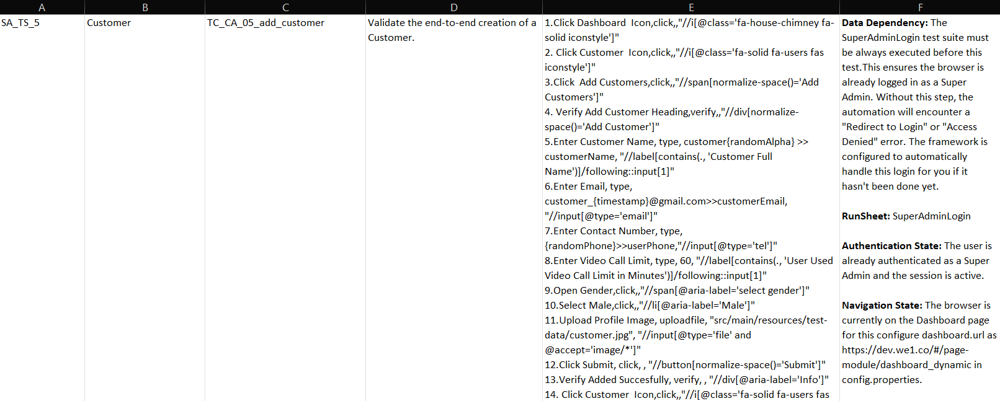

# 📱💻 ABCD Hybrid Framework: Full Keywords Dictionary

This document is the official reference for writing automated test cases. The `StepParser` uses natural language processing (Regex) to match your Excel steps to automation actions.

## 📊 Quick Start: How to Write Test Cases in Excel

To ensure the framework parses your automation suites correctly, you must follow the strict formatting structure outlined below when designing your Excel sheets.



### I. The Core Columns (Where to Write)

* **Column E (5th Column) - Test Step Description:** This is the core execution column where the `StepParser` reads your test actions line-by-line.
* **Column F (6th Column) - Precondition & Data Dependency:** This column manages structural dependencies. If your current sheet relies on data or a state created by another sheet, use the **`RunSheet:`** keyword followed immediately by the target sheet name (e.g., `RunSheet: SuperAdminLogin`). The framework will temporarily pause execution of the current sheet, execute the target dependency sheet completely to set up the context, and then seamlessly return to continue running your active test case.

---

### II. Column E Formatting & The 3-Comma Syntax Rule

Every automated instruction written inside **Column E** must follow a strict **3-comma layout structure** separating 4 parameters:

---

<br>

<div align="center">
  <p>⚠️ <b>CRITICAL RULES FOR WRITING TEST STEPS</b> ⚠️</p>
  <table>
    <tr>
      <td align="center" style="background-color: #2d3748; padding: 20px; border: 3px solid #e53e3e; border-radius: 8px;">
        <span style="font-size: 26px; font-weight: bold; color: #f7fafc; letter-spacing: 1px; font-family: monospace;">
          Test Step Description , Action , Value , "XPath/Locator"
        </span>
      </td>
    </tr>
  </table>
  <p><i>Every automated instruction written inside <b>Column E</b> must follow this exact 3-comma layout.</i></p>
</div>

<br>

---

1. **Test Step Description:** A clean human-readable note describing what the step is doing for validation purposes.
2. **Action:** The explicit system action keyword that the test executor will execute (e.g., `click`, `type`, `wait`, `uploadfile`, `switch_to`).
3. **Value:** The parameters or inputs needed for the action (such as text values, numbers, dynamic variables, or system file paths).
4. **Locator / XPath:** The selector value or properties key, which **must always be enclosed in double quotes (`""`)**.

---
## 🛑 💡 QUICK REFERENCE FOR WRITING EXCEL TEST CASES 💡 🛑

> ### ⚠️ CRITICAL SYNTAX RULE REMINDER
> Every line written inside **Column E** of your Excel sheet MUST use the **3-comma rule**:
> `Test Step Description , Action , Value , "Target/Locator"`
> *Locators and file paths must always be wrapped in **double quotes (`""`)**. Leave fields completely empty when they are "Not Needed".*

### 📊 Keywords for Web & Mobile Automation

<table>
  <thead>
    <tr style="background-color: #1a202c; color: #ffffff;">
      <th>Test Step Description</th>
      <th>Action</th>
      <th>Value</th>
      <th>Target (XPath/ID)</th>
      <th> Values That Are Accepted </th>
    </tr>
  </thead>
  <tbody>
    <!-- WEB SPECIFIC KEYWORDS SUBSECTION -->
    <tr style="background-color: #ebf8ff; font-weight: bold;">
      <td colspan="5" style="color: #2b6cb0; padding: 10px;">🌐 SUBSECTION 1: WEB SPECIFIC KEYWORDS</td>
    </tr>
    <tr>
      <td>Switch to Super admn</td>
      <td><code>switch_to</code></td>
      <td>web</td>
      <td><i>Not Needed</i></td>
      <td>Accepts: <code>user</code>, <code>driver</code>, <code>web</code></td>
    </tr>
    <tr>
      <td>Click Submit</td>
      <td><code>click</code></td>
      <td><i>Not Needed</i></td>
      <td>"web.global.action.submit"</td>
      <td>No Value Needed</td>
    </tr>
<tr>
    <td>Click If Element Is Present</td>
    <td><code>click_if_present</code></td>
    <td>Not Needed</td>
    <td><i>"mobile.driver.independent_contractor.checkbox"</i></td>
    <td>No Value Needed</td>
  </tr>
<tr>
    <td>Hover Over Element</td>
    <td><code>hover</code></td>
    <td>Not Needed</td>
    <td><i>"mobile.driver.download.btn.active"</i></td>
    <td>No Value Needed</td>
  </tr>
    <tr>
      <td>Enter Bank Name</td>
      <td><code>type</code></td>
      <td>HDFC Bank</td>
      <td>"admin.drivers.bankname.input"</td>
      <td>Any text written here will be typed into the input field of the given locator.</td>
    </tr>
    <tr>
      <td>Upload Customer Photo</td>
      <td><code>uploadfile</code></td>
      <td>"src/main/resources/test-data/autodriver.jpg"</td>
      <td>"admin.drivers.profile_image.file"</td>
      <td>The file path value <b>must</b> be written in double quotes [" "].</td>
    </tr>
    <tr>
      <td>Open Admin Panel</td>
      <td><code>openurl</code></td>
      <td>https://dev.we1.co/#/login</td>
      <td><i>Not Needed</i></td>
      <td>Write the exact URL you need to open.</td>
    </tr>
    <tr>
      <td>Wait for photo upload</td>
      <td><code>wait</code></td>
      <td>3000</td>
      <td><i>Not Needed</i></td>
      <td>Write the time in milliseconds (e.g., if 2 seconds are needed, write 2000).</td>
    </tr>
    <tr>
      <td>Wait For Dahboared to Apper</td>
      <td><code>wait_until_visible</code></td>
      <td><i>Not Needed</i></td>
      <td>"web.global.menu.dashboard"</td>
      <td>No Value Needed</td>
    </tr>
    <tr>
      <td>Scroll Grid Right</td>
      <td><code>tab</code></td>
      <td>5</td>
      <td>"admin.drivers.name_filter.input"</td>
      <td>Provide the property locator key from which the tab action should begin, and the number of tabs required to reach the target element.</td>
    </tr>
    <tr>
      <td>Check Delivery Service Not exists</td>
      <td><code>element_absent</code></td>
      <td><i>Not Needed</i></td>
      <td>"admin.city_admin.chk_web_delivery"</td>
      <td>No Value Needed</td>
    </tr>
    <tr>
      <td>Check Transport Menu exists</td>
      <td><code>element_present</code></td>
      <td><i>Not Needed</i></td>
      <td>"admin.transport.menu.card"</td>
      <td>No Value Needed</td>
    </tr>
    <tr>
      <td>Map City Boundary</td>
      <td><code>draw    polygon</code></td>
      <td>"-60;-60 : 60;-60 : 60;60 : -60;60 "</td>
      <td>"//div[@class='ol-layer']//canvas"</td>
      <td>The coordinate sequence string <b>must</b> be wrapped in double quotes. Use raw XPaths here (do not use property keys).</td>
    </tr>
    <tr>
      <td>Select First Option</td>
      <td><code>arrow_down</code></td>
      <td><i>No value neded</i></td>
      <td>"admin.store.location.input"</td>
      <td>No Value Needed</td>
    </tr>
    <tr>
      <td>Press Enter</td>
      <td><code>press_enter</code></td>
      <td><i>No Value Needed</i></td>
      <td>"admin.store.location.input"</td>
      <td>No Value Needed</td>
    </tr>
    <tr>
      <td>Verify Delivery Services Heading</td>
      <td><code>verify</code></td>
      <td><i>No Value Needed</i></td>
      <td>"admin.deliveryservice.header"</td>
      <td>No Value Needed</td>
    </tr>
    <tr>
      <td>Enter Dynamic User Name</td>
      <td><code>type</code></td>
      <td>customer_{timestamp}>>customerName</td>
      <td>"customer.fullname.input"</td>
      <td>Generates dynamic runtime parameters using expressions like <code>{timestamp}</code> or <code>{randomAlpha}</code>.</td>
    </tr>
    <tr>
      <td>Enter Random Phone Number</td>
      <td><code>type</code></td>
      <td>{randomPhone}</td>
      <td>"admin.drivers.phone.input"</td>
      <td>Generates a random Indian mobile phone format automatically via <code>{randomPhone}</code>.</td>
    </tr>
    <tr>
      <td>Search dymanic name</td>
      <td><code>type</code></td>
      <td>{ customerName }</td>
      <td>"admin.customer name.input"</td>
      <td>Passes a previously saved runtime variable by wrapping its name inside curly braces <code>{variableName}</code>.</td>
    </tr>
<tr>
    <td>Enter Date</td>
    <td><code>set_date</code></td>
    <td>2026-12-12</td>
    <td><i>admin.drivers.doc_expiry.input</i></td>
    <td>2026-12-12 [Enter Date In This Format YYYY-MM-DD]</td>
  </tr>
<tr>
    <td>Extract Otp From Screen</td>
    <td><code>store_text</code></td>
    <td>ride_otp [Name of Variable ]</td>
    <td><i>mobile.customer.otp_display_element</i></td>
    <td>In value field add a variable name to store the extracted vlaue</td>
  </tr>
<tr>
    <td>Compare Values Stored In Variable</td>
    <td><code>verify_variables_match</code></td>
    <td>emergencyPhone [Name of Variable 1]</td>
    <td><i>saved_emergencyPhone [Name of Variable 2]</i></td>
    <td>In Value and locator fields enter the variable names whose value is to be compared</td>
  </tr>
    <!-- MOBILE SPECIFIC KEYWORDS SUBSECTION -->
    <tr style="background-color: #fef3c7; font-weight: bold;">
      <td colspan="5" style="color: #b45309; padding: 10px;">📱 SUBSECTION 2: MOBILE SPECIFIC KEYWORDS</td>
    </tr>
    <tr>
      <td>Load Driver App</td>
      <td><code>switch_to</code></td>
      <td>driver</td>
      <td><i>Not Needed</i></td>
      <td>Accepts: <code>user</code>, <code>driver</code>, <code>web</code></td>
    </tr>
    <tr>
      <td>Enter Mobile Number</td>
      <td><code>type</code></td>
      <td>9967110008</td>
      <td>"mobile.driver.edit_text.input"</td>
      <td>Any value written here will be typed directly into the targeted mobile input locator.</td>
    </tr>
    <tr>
      <td>Click submit</td>
      <td><code>tap</code></td>
      <td><i>Not Needed</i></td>
      <td>"mobile.driver.submit.btn"</td>
      <td>No Value Needed</td>
    </tr>
    <tr>
      <td>Wait For Popup</td>
      <td><code>wait_until_visible</code></td>
      <td><i>Not Needed</i></td>
      <td>"mobile.driver.independent_contractor.checkbox"</td>
      <td>No Value Needed</td>
    </tr>
    <tr>
      <td>Drag Page Layout Upward</td>
      <td><code>swipe</code></td>
      <td>up</td>
      <td><i>Not Needed</i></td>
      <td>Accepts <code>up</code> (to swipe up the screen) or <code>down</code> (to swipe down the screen). Swipes the general viewport context.</td>
    </tr>
    <tr>
      <td>Force Driver Location</td>
      <td><code>set_location</code></td>
      <td>13.0533;80.2514</td>
      <td><i>Not Needed</i></td>
      <td>Injects explicit global coordinates directly into the active device instance. Enter as <code>Latitude;Longitude</code>.</td>
    </tr>
    <tr>
      <td>Click Online Toggle</td>
      <td><code>tap_coordinate</code></td>
      <td>986:1936</td>
      <td><i>Not Needed</i></td>
      <td>Performs a point click interaction directly on the device display using specific pixel offsets (<code>X:Y</code>) obtained from Appium Inspector.</td>
    </tr>
    <tr>
    <td>Reload User App Completely</td>
    <td><code>reload_app</code></td>
    <td>user</td>
    <td><i>Not Needed</i></td>
    <td>Accepts: <code>user</code>, <code>driver</code>, <code>store</code>. Restarts the app from a clean baseline session state.</td>
  </tr>
<tr>
    <td>Click If Element Is Present</td>
    <td><code>tap_if_present</code></td>
    <td>Not Needed</td>
    <td><i>"mobile.driver.independent_contractor.checkbox"</i></td>
    <td>No Value Needed</td>
  </tr>
<tr>
    <td>Wait If Element Is Present</td>
    <td><code>wait_if_present</code></td>
    <td>Not Needed</td>
    <td><i>"mobile.driver.independent_contractor.checkbox"</i></td>
    <td>No Value Needed</td>
  </tr>
<tr>
    <td>Fetch OTP/Referal Code From DB</td>
    <td><code>fetch_db_value</code></td>
    <td>ride_otp[Use any variable name to store fetch data from db]</td>
    <td><i>"SELECT otp FROM we1.user_ride_booking ORDER BY id DESC LIMIT 1"[write Query In Place Of Xpath]</i></td>
    <td>Use Any Variable</td>
  </tr>
  </tbody>
</table>

---

## 📋 ⚡ Excel Sheet Writing Helper [Copy paste action formats from this section]

> **💡 QUICK COPIER GUIDE:** The lines below are designed for zero-typing script creation. Simply highlight the text line, copy it, and paste it directly into **Column E** of your Excel automation files.

---

### <span style="color:#e53e3e; font-size:22px; font-weight:bold;"># 💻 WEB AUTOMATION KEYWORD FORMATS COPY PASTE FROM IT #</span>

<br>

#### **# 🔄 “switch_to” Keyword Format #**
`Switch to User App/Driver App/Super Admin,switch_to,user/driver/web,`

#### **# 🖱️ “click” Keyword Format #**
`Click description,click,,"Locator/Xpath"`

#### **# ⌨️ “type” Keyword Format #**
`Enter Description,type,value,"Locator/Xpath"`

#### **# 🎲 “type” Keyword Format while using Dynamic Data Generation #**
`Enter Description,type,name{randomAlpha}/{timestamp}>>variableName,"Locator/Xpath"`

#### **# 🔍 “type” Keyword Format for searching dynamically created Data for example customer or driver #**
`Filter Variable Name,type,{variableName},"Locator/Xpath"`

#### **# 📱 “type” Keyword Format for dynamic mobile number generation #**
`Enter Mobile Number,type,{randomPhone}>>phoneNumber,"Locator/Xpath"`

#### **# 🔎 “type” Keyword Format for searching dynamically created phone Number #**
`Filter Phone Number,type,{randomPhone},"Locator/Xpath"`

#### **# 🔎 “hover” Keyword Format for searching dynamically created phone Number #**
`Hover Over Element,hover,,"Locator/Xpath"`

#### **# 📁 “uploadfile” Keyword Format #**
`Upload Description,uploadfile,"src/main/resources/test-data/photoName.format","Locator/Xpath"`

#### **# 🌐 “openurl” Keyword Format #**
`Go To Url,openurl,[Type url Here],`

#### **# ⏳ “wait” Keyword Format #**
`Wait For Description,wait,2000[Enter Wait Time In This Format Milli Second],`

#### **# 👁️ “wait_until_visible” Keyword Format #**
`Wait For Descrption,wait_until_visible,,"Locator/Xpath"`

#### **# 📑 “tab” Keyword Format #**
`Scroll Grid,tab,10[Enter Tab Number Required],"Locator/Xpath"`

#### **# ❌ “element_absent” Keyword Format #**
`Check Element Dont exists,element_absent,,"Locator/Xpath"`

#### **# 🛡️ “element_present” Keyword Format #**
`Check Element exists,element_present,,"Locator/Xpath"`

#### **# 🗺️ “draw polygon” Keyword Format #**
`Map Polygon,draw polygon,"-60;-60 : 60;-60 : 60;60 : -60;60[Enter Cordinate in this Format in double quotes]","Xpath[Use Xapth Only in This Case don’t use Locator]"`

#### **# 🔽 “arrow_down” Keyword Format #**
`Select From Dropdown,arrow_down,,"Locator/Xpath"`

#### **# ↩️ “press_enter” Keyword Format #**
`Enter Description,press_enter,,"Locator/Xpath"`

#### **# ✅ “verify” Keyword Format #**
`Verify Description,verify,,"Locator/Xpath"`

#### **# ✅ To "set_date" in Date Picker #**
`Enter Date,set_date,2026-12-12[In YYYY-MM-DD Format],"Locator/Xpath"`


#### **# ✅  "store_text" keyword to extract data from an xpath or locator #**
`Extract OTP from Screen,store_text,ride_otp[variable name],"Locator/Xpath"`

#### **# ✅  "verify_variables_match" keyword to verify value inside two variables are equal #**
`Verify Emergeny Number Matches,verify_variables_match,emergencyPhone[variable name 1],stored_emergencyPhone[variable name 2]`

---

### <span style="color:#2b6cb0; font-size:22px; font-weight:bold;"># 📱 MOBILE AUTOMATION KEYWORD FORMATS COPY PASTE FROM IT #</span>

<br>

#### **# 🔄 “switch_to” Keyword Format #**
`Switch to User App/Driver App/Super Admin,switch_to,user/driver/web,`

#### **# 🎯 “tap” Keyword Format #**
`Click Description,tap,,"Locator"`

#### **# ⌨️ “type” Keyword Format #**
`Enter Description,type,value,"Locator"`

#### **# 🎲 “type” Keyword Format while using Dynamic Data Generation #**
`Enter Description,type,name{randomAlpha}/{timestamp}>>variableName,"Locator"`

#### **# 🔍 “type” Keyword Format for Entering dynamically created Data for example customer or driver #**
`Enter Variable Name,type,{variableName},"Locator"`

#### **# 📱 “type” Keyword Format for dynamic mobile number generation #**
`Enter Mobile Number,type,{randomPhone}>>phoneNumber,"Locator"`

#### **# 🔎 “type” Keyword Format for entering dynamically created phone Number #**
`Enter Phone Number,type,{randomPhone},"Locator"`

#### **# 📁 “uploadfile” Keyword Format #**
`Upload Description,uploadfile,"src/main/resources/test-data/photoName.format","Locator"`

#### **# 👁️ “wait_until_visible” Keyword Format #**
`Wait For Descrption,wait_until_visible,,"Locator"`

#### **# ↕️ “swipe” Keyword Format #**
`Drag Page Layout Upward/Downward,swipe,up/down,`

#### **# 📍 “tap_coordinate” Keyword Format #**
`Click Description,tap_coordinate,75:209[Type Cordinate in this formatt],COORDINATE_MODE`

#### **# 🗺️ “set_location” Keyword Format #**
`Set Emulator Location, set_location,13.0533;80.2514 [Type Cordinate in this format],`

#### **# 🔄 “reload_app” Keyword Format #**
`Reload User/Driver App Completely, reload_app,user/driver,`

#### **# 🔄 “tap_if_present” Keyword Format #**
`Tap If Element Is Present,tap_if_present,,"Locator"`

#### **# 🔄 “wait_if_present” Keyword Format #**
`Wait If Element Is Present,wait_if_present,,"Locator"`


#### **# 🔄 “fetch_db_value” Keyword Format #**
`Fetch OTP/Refereal Code from DB,fetch_db_value,variable to store fetched balue from db,"Query"`


---

## 🚀 1. Hybrid Orchestration (Multi-Session)
These keywords are the "brain" of the hybrid framework. They allow you to switch control between your browser and multiple mobile devices in a single test script.

| Action | Phrase Examples | Description |
| :--- | :--- | :--- |
| **`switch_to`** | switch_to, focus, load | Moves the execution focus to a different platform. Values: **web**, **user**, **driver**. |

**Excel Example:**

| Test Step Description | Action | Value | Target (XPath/ID) |
| :--- | :--- | :--- | :--- |
| Switch to User App | **switch_to** | **user** | - |
| Switch to Driver App | **switch_to** | **driver** | - |
| Switch back to Admin | **switch_to** | **web** | - |

---

## 🚀 2. Centralized Element Mapper (Zero-Maintenance Sheets)

To eliminate test maintenance fatigue when development teams update UI elements or application layouts, **never hardcode raw XPaths, IDs, or Automator expressions inside your Excel test sheets.** Instead, assign elements a standardized key name inside your centralized properties configuration. The framework's internal `LocatorMapper` engine automatically intercepts these keys at runtime, matches them to the real selectors, and handles execution seamlessly.

> **💡 The Maintenance Advantage:** If a developer changes an element's XPath or Resource ID next week, you only modify it **once** in your `.properties` file. You do **not** have to edit or re-upload dozens of different Excel regression sheets.

### 📋 Step 1: Define Elements in `locator.properties`
Group your selectors cleanly by platform and module. You can mix Web XPaths, native Appium IDs, Accessibility IDs, and Android UI Automator expressions together:

```properties
# =========================================================================
# CENTRALIZED LOCATOR REPOSITORY (locator.properties)
# =========================================================================

# 💻 Web Admin Portal Elements
admin.drivers.menu.icon=//i[contains(@class,'fa-motorcycle fa-solid iconstyle')]
admin.drivers.fullname.input=//label[contains(.,'Full Name')]/following::input[1]
admin.drivers.phone.input=//input[@type='tel']
admin.drivers.profile_image.file=//input[@type='file']
admin.drivers.submit.button=//button[contains(.,'Submit')]
admin.drivers.success_toast.div=//div[@aria-label='Added Successfully']

# 📱 Mobile Driver App Elements (High-Speed Native Selectors)
mobile.driver.permission_allow.btn=id=com.android.permissioncontroller:id/permission_allow_button
mobile.driver.agree.btn=automator=new UiSelector().text("AGREE & CONTINUE")
mobile.driver.get_started.btn=accessibility=Get Started
mobile.driver.next.btn=id=com.we1.driver:id/btn_next
mobile.driver.mobile_number_field.btn=automator=new UiSelector().className("android.widget.EditText")
```
### 📊 Setup in Excel Sheet
Your Excel sheet stays clean, readable, and focused purely on business logic. Use the exact key names from your properties file in the **Target / Locator** column:

| Step | Test Step Description | Action | Value | Target (Property Key Only) |
| :--- | :--- | :--- | :--- | :--- |
| **1** | Open Admin Panel | `openurl` | - | https://dev.we1.co/#/login |
| **2** | Click Drivers Menu | `click` | - | "**admin.drivers.menu.icon**" |
| **3** | Type Unique Name | `type` | Onboard_{randomAlpha} >> autoName | "**admin.drivers.fullname.input**" |
| **4** | Type Unique Phone | `type` | 98{timestamp} >> driverPhone | "**admin.drivers.phone.input**" |
| **5** | Attach Profile Photo | `uploadfile` | src/main/resources/test-data/driver.jpg | "**admin.drivers.profile_image.file**" |
| **6** | Attach Vehicle Photo | `uploadfile` | src/main/resources/test-data/auto.jpg | "**admin.drivers.vehicle_image.file**" |
| **7** | Click Save Record | `click` | - | "**admin.drivers.submit.button**" |

---

## 📱 3. Mobile Specific Actions
Handled by the `MobileActions.java` class. These keywords are optimized for Appium. To ensure maximum execution speed and stability, the framework explicitly prioritizes direct locators (**Accessibility ID**, **Resource ID**, and **Android UI Automator**) over slower XPath expressions.

| Action                   | Phrase Examples                      | Description |
|:-------------------------|:-------------------------------------| :--- |
| **`tap`**                | tap, mobile click                    | Performs a touch interaction. Parses fast-execution locators like `accessibility=`, `id=`, or `automator=` before falling back to XPath. |
| **`type`**               | type, enter text                     | Clears the field and inputs text into the targeted element using optimized locators. |
| **`wait_until_visible`** | wait for element, wait until visible | Pauses execution dynamically until the target element is visible on the screen. |
| **`swipe`**              | swipe, scroll                        | Swipes the screen in the specified direction. Values: **up**, **down**. |
| **`hide_keyboard`**      | hide keyboard, close keypad          | Dismisses the mobile keyboard to prevent UI obstruction (essential for form flows). |
| **`set_location`**       | set location, geo location           | Inject custom GPS coordinates (Latitude;Longitude) into the active emulator mid-test. |
| **`reload_app`**         | reload app                           | Fully restarts the targeted app (`user`, `driver`, or `store`) from a clean baseline session state to bypass caching or hanging screens. |
 | **`tap_if_present`**     |tap_if_present                      | Tap an element if present if not presrnt skips the step  |

### High-Speed Locator Syntax Examples
When executing actions, use the prefix mapping below to bypass slow XPath parsing:
* **Accessibility ID:** `accessibility=Get Started`
* **Resource ID:** `id=com.we1.customer:id/et_email`
* **UI Automator:** `automator=new UiSelector().text("Submit")`

---

> ⚠️ **IMPORTANT ALERT ON WAITS:** > Always utilize the dynamic **`wait_until_visible`** action strategy. Relying on hardcoded thread sleeps or setting excessive execution timeout limits (e.g : wait,3000) can severely degrade emulator performance, exhaust system memory, and trigger network timeouts or ADB disconnections mid-run.

---

### Excel Test Sheet Example

| Test Step Description                       | Action                           | Value                       | Target (Locator Strategy) |
|:--------------------------------------------|:---------------------------------|:----------------------------| :--- |
| Click Get Started Button                    | **tap**                          | -                           | "accessibility=Get Started" |
| Enter User Email Address                    | **type**                         | mohammed.faizal@example.com | "id=com.we1.customer:id/et_email" |
| Click Form Submit Button                    | **tap**                          | -                           | "automator=new UiSelector().text("Submit")" |
| Wait for Done                               | **wait_until_visible**           | -                           | "accessibility=Done" |
| Hide Active Keyboard                        | **hide_keyboard**                | -                           | - |
| Force Driver Location                       | **set_location**                 | 13.0533;80.2514             | - |
| Scroll Down App Screen                      | **swipe**                        | **down**                    | - |
| Reload Driver App                           | **reload_app**                   | **driver**                  | - |
| Tap if Element Present                      | **tap_if_present**               | -                           | "accesibility = submit" |
---

## 🛠️ 4. Navigation & System

| Action | Phrase Examples (Natural Language) | Description |
| :--- | :--- | :--- |
| **openurl** | `Maps to`, `open url`, `go to url`, `Maps` | Opens a specific website URL. |
| **back / forward** | `back`, `forward` | Browser navigation history. |
| **max / min** | `maximize`, `minimize` | Controls the browser window size. |
| **screenshot** | `screenshot`, `take screenshot` | Captures the current screen. |

**Excel Example:**

| Test Step Description | Action | Value | Target (XPath) |
| :--- | :--- | :--- | :--- |
| Open Login Page | openurl | - | https://dev.we1.co/#/login |
| Maximize Browser | maximize | - | - |

---

## ⌨️ 5. Interactions & Input

| Action          | Phrase Examples (Natural Language)          | Description                                    |
|:----------------|:--------------------------------------------|:-----------------------------------------------|
| **type**        | `enter the`, `type`, `input`, `fill`        | Enters text into a field.                      |
| **click**       | `click`, `press`                            | Clicks a button, link, or element.             |
| **hover**       | `hover`                                     | hover Over a button, link, or element.         |
| **clear**       | `clear text`, `empty field`, `remove value` | Wipes the content of an input box.             |
| **select**      | `select [value]`                            | Selects from a dropdown (excludes file/radio). |
| **tab**         | `tab key`, `tab`                            | Simulates the **TAB** key.                     |
| **press_enter** | `press enter`, `enter key`                  | Simulates the **ENTER** key.                   |
| **arrows**      | `arrow_down`, `arrow_up`                    | Simulates keyboard arrow keys.                 |

**Excel Example:**

| Test Step Description  | Action | Value | Target (XPath) |
|:-----------------------|:-------| :--- | :--- |
| Enter SuperAdmin Email | type   | admin@gmail.com | "//input[@placeholder='Enter email']" |
| Click Login Button     | click  | - | "//button[@type='submit']" |
| Hover Over Button      | hover  | - | "//button[@type='submit']" |
| Scroll Grid Right      | tab    | 5 | "//div[@class='grid-body']" |

---

## 📁 6. File Uploads & System Tools

| Action | Phrase Examples (Natural Language) | Description |
| :--- | :--- | :--- |
| **uploadfile** | `upload`, `attach`, `select file`, `choose file` | Handles standard web file uploads. |
| **waitforupload**| `wait for upload` | Pauses until a file finishes uploading. |
| **autoit** | `autoit`, `runautoit`, `executeautoit` | Triggers an AutoIt script for system dialogs. |
| **robotupload** | `robot`, `robotupload`, `uploadrobot` | Uses Java Robot class for OS-level uploads. |

**Excel Example:**

| Test Step Description | Action | Value | Target (XPath) |
| :--- | :--- | :--- | :--- |
| Upload License Image | uploadfile | "src/main/resources/test-data/license.jpg" | "//input[@type='file']" |

---

## 🔍 7. Verification & Assertions

| Action | Phrase Examples (Natural Language) | Description |
| :--- | :--- | :--- |
| **verifyvisible** | `displayed`, `visible`, `appear`, `shown` | Confirms element is on screen. |
| **verifyhidden** | `not displayed`, `should not appear`, `hidden` | Confirms element is NOT visible. |
| **verifytext** | `verify text`, `label`, `verify exact text` | Checks if the text matches exactly. |
| **verifycontains**| `contains`, `text contains`, `label contains` | Checks if text exists within a string. |
| **verifyenabled** | `enabled`, `disabled` | Checks if a button is clickable or greyed out. |
| **verifyselected**| `selected`, `checked` | Checks state of checkboxes/radio buttons. |

**Excel Example:**

| Test Step Description | Action | Value | Target (XPath) |
| :--- | :--- | :--- | :--- |
| Verify Dashboard Load | verifyvisible | - | "//div[contains(text(),'Statistics')]" |
| Check Success Toast | verifytext | Added Successfully | "//div[@role='alert']" |

---

## 🛡️ 8. Advanced Presence Assertions (Negative Testing)

These keywords allow you to perform strict validation on whether an element should or should not exist in the DOM. This is particularly useful for verifying **Role-Based Access Control (RBAC)** where certain menus must be hidden from specific users.

| Action | Phrase Examples | Description |
| :--- | :--- | :--- |
| **element_present** | `element exists`, `present` | Confirms an element is in the DOM. Uses a **5-second explicit wait** before failing. |
| **element_absent** | `element not present`, `absent` | Confirms an element is **NOT** in the DOM. It temporarily disables implicit waits to perform an immediate check without slowing down the test. |

**Excel Example:**

| Test Step Description | Action | Value | Target (XPath) |
| :--- | :--- | :--- | :--- |
| Check Transport Menu exists | element_present | - | "//h2[normalize-space()='Transport Services']" |
| Check Delivery Service exists | element_absent | - | "//h2[normalize-space()='Delivery Services']" |
| Check Provider Service exists | element_absent | - | "//h2[normalize-space()='Provider Services']" |

> **💡 Technical Note:** When using `element_absent`, the framework automatically sets `implicitlyWait` to 0 seconds to ensure the check is instantaneous, then restores your default settings immediately after.
---


## ⏳ 9. Explicit Waits & Toasts

| Action | Phrase Examples (Natural Language) | Description |
| :--- | :--- | :--- |
| **waitforvisible**| `wait until visible`, `wait for visible` | Pauses until element appears. |
| **waitforpageload**| `wait for page`, `wait for load` | Waits for the entire page to finish loading. |
| **waitfortoast** | `wait for toast` | Pauses for the success/error message popup. |
| **verifysuccesstoast**| `toast success` | Specifically checks for a green success toast. |
| **wait** | `wait 5` | A simple static pause (value is in seconds). |

**Excel Example:**

| Test Step Description | Action | Value | Target (XPath) |
| :--- | :--- | :--- | :--- |
| Wait for Success | waitfortoast | - | - |
| Hard Pause | wait | 3 | - |

---

## 🖱️ 10. Scrolling, Frames & Maps

| Action | Phrase Examples (Natural Language) | Description |
| :--- | :--- | :--- |
| **scrolltoelement**| `scroll to element`, `scroll to` | Moves view to a specific element. |
| **scrolltotop** | `scroll up`, `scroll to top` | Moves to the top of the page. |
| **scrolltobottom**| `scroll down`, `scroll to bottom` | Moves to the bottom of the page. |
| **switchtoframe** | `switch to frame` | Moves driver focus inside an iFrame. |
| **drawpolygon** | `draw the polygon` | Specialized interaction for map elements. |
| **verifygridvalue**| `verify grid` | Checks values inside a data table/grid. |

**Excel Example:**

| Test Step Description | Action      | Value                             | Target (XPath) |
| :--- |:------------|:----------------------------------| :--- |
| Map City Boundary | drawpolygon | -60;-60 : 60;-60 : 60;60 : -60;60 | "//div[@class='map-container']" |

---

## 📅 11. Date Input & Picker Actions

This keyword allows you to input dates consistently into standard text fields, HTML5 date pickers, or custom calendar components. It formats and simulates keypresses or direct script injections to ensure dates are reliably applied across both Web and Mobile platforms.

| Action | Phrase Examples | Description |
| :--- | :--- | :--- |
| **set_date** | `enter date`, `set date` | Clears the target input field and types or injects a formatted date string. Expects the standard **`YYYY-MM-DD`** ISO format. |

**Excel Example:**

| Test Step Description | Action | Value | Target (XPath / Locator) |
| :--- | :--- | :--- | :--- |
| Enter License Expiry Date | set_date | 2026-12-12 | admin.drivers.doc_expiry.input |
| Enter Vehicle Registration Date | set_date | 2026-08-15 | admin.vehicles.reg_date.input |

> **⚠️ IMPORTANT:** Date values provided in the **Value** column MUST always strictly follow the **`YYYY-MM-DD`** format (e.g., `2026-12-12`). Passing dates in other formats (such as `DD/MM/YYYY` or `MM-DD-YYYY`) will result in parsing failures or invalid inputs.

> **💡 Technical Note:** Date inputs often trigger dynamic change listeners or validation scripts upon typing. The `set_date` action automatically fires change/blur events (or triggers a keyboard enter key on mobile) to ensure the framework registers the value properly.
---

## 🎲 12. Dynamic Placeholders (Value Column)

| Placeholder | Result Example | Best For |
| :--- | :--- | :--- |
| **`{timestamp}`** | `301715` | Unique IDs/Names (Numbers only). |
| **`{randomAlpha}`** | `QWERTZ` | **Plumber Names** (Letters only). |
| **`{randomPhone}`** | `9845123456` | Valid 10-digit Indian Mobile format. |

**Excel Example:**

| Test Step Description | Action | Value                | Target (XPath) |
| :--- | :--- |:---------------------| :--- |
| Enter Unique Area | type | Chennai_{timestamp}  | "//input[@id='areaName']" |
| Enter Plumber Name | type | Plumber{randomAlpha} | "//input[@id='providerName']" |

> **⚠️ STRICT VALIDATION RULE:** If a field (like Plumber Name) does not allow numbers or underscores, use **`Plumber{randomAlpha}`** directly (No spaces, no symbols).

---

## 💾 13. Save & Reuse Logic

Capture a value in one step to use it in a later step.

### **How to Save:**

Use the `>>` operator in the **Value** column.
- **Action:** `type`
- **Value:** `NewUser{randomAlpha} >> savedName`
- *Result:* Generates `NewUserBQK`, types it, and stores it as "savedName".

### **How to Reuse:**

Wrap the variable name in curly braces `{}`.
- **Action:** `type`
- **Value:** `{savedName}`
- *Result:* Types the exact same value generated previously.

**Excel Example:**

| Step | Description | Action | Value | Target (XPath) |
| :--- | :--- | :--- | :--- | :--- |
| 1 | Create Store Name | type | KFC_{timestamp} >> storeName | "//input[@id='sname']" |
| 2 | ...Other Steps... | ... | ... | ... |
| 3 | Filter Created Store | type | {storeName} | "//input[@placeholder='Search']" |

---

## 💾 14. Runtime Data Extraction & Variable Matching

| Action | Phrase Examples (Natural Language) | Description |
| :--- | :--- | :--- |
| **store_text** | `store_text`, `capture_value` | Extracts visible text, web input values, or mobile descriptors and stores them in a temporary runtime variable map. |
| **verify_variables_match** | `verify_variables_match`, `compare_variables`, `match_variables` | Evaluates two extracted runtime variables from the map and asserts that their values match exactly. |

**Excel Examples:**

| Test Step Description | Action | Value | Target (XPath) |
| :--- | :--- | :--- | :--- |
| Extract Emergency Contact Saved from Screen | store_text | `stored_emergency_number` | `"admin.customer.input_Emergency_phone"` |
| Verify Emergency Number Matches | verify_variables_match | `stored_emergency_number` | `emergencyPhone` |

> 💡 **Important Usage Rules:**
> * **No Curly Braces `{}` in variables match:** When using `verify_variables_match`, type the raw variable names directly into the columns (e.g., `emergencyPhone`). Do not use `{}` here, as the action maps directly to the tracking keys.
> * **Automatic Web Input Fallback:** The `store_text` keyword automatically detects if an element is a web form input field and extracts the hidden text using its `value` attribute seamlessly without breaking native mobile properties.

---

## 📊 15. Reporting & Debugging
The framework is designed to make debugging easy:
1.  **Red Box Highlighting:** If a step fails, the report screenshot will show a **Red Border** around the specific element that failed.
2.  **Video Logs:** Check `test-outputs/videos` for a full recording of the execution.
3.  **Smart Errors:** The framework tells you if the error was a "Timeout" (Missing element) or a "Validation Error" (Form rejected).

---

## 🔗 16. Cross-Sheet Dependencies (Preconditions)

The framework supports **Recursive Dependencies**. If one test suite (Sheet) requires data or a state created in another sheet, you can link them directly within the Excel file.

### **How to Use**
In the **Precondition** column (Column 5) of the **very first test case row** (Row 2) of your sheet, use the keyword `RunSheet:` followed by the exact name of the required sheet.

**Excel Example (Inside "AddCityAdmin" sheet):**

| Test Case ID | ... | Precondition |
| :--- | :--- | :--- |
| TC_CA_02 | ... | **Data Dependency:** This test requires an existing area. <br><br> **RunSheet: AddCityArea** <br><br> **Authentication:** SuperAdmin session must be active. |

### **How It Works**
1.  **Detection:** The framework scans the Precondition cell for the `RunSheet:` trigger.
2.  **Recursion:** It automatically pauses the current sheet (`AddCityAdmin`), switches to the dependency sheet (`AddCityArea`), and executes all its steps.
3.  **Return:** Once the dependency sheet finishes, the framework automatically returns to the original sheet to continue the test.
4.  **Smart Execution:** To save time, if `AddCityArea` has already been completed earlier in the same execution run, the framework will recognize this and skip the redundant run.

> **💡 Pro-Tip:** You can include as much descriptive text as you like in the Precondition column (authentication steps, system requirements, etc.). The framework is smart enough to find the `RunSheet:` keyword hidden anywhere in that text.

---
## 🗄️ 17. Database Operations (Extraction & Cleanup)

This module allows the automation framework to interact directly with the PostgreSQL database. It supports two critical workflows: extracting live database values (like dynamic OTPs) mid-test to bypass hardware UI barriers, and clearing out test data at the end of a run to prevent duplicate entry blocks.

> [!CAUTION]
> ### ⚠️ **WARNING: DATABASE WRITE & MUTATION RULES**
> Destructive actions interact **directly** with the target database. Careless queries can result in permanent data loss.
> * **Double-check your syntax** before saving queries to your Excel sheets.
> * **Always scope queries with specific identifiers** (like `{areaName}` or `{autoName}`) to mutate only test-specific records.
> * **Never** attempt to execute queries on schemas or tables you are not authorized to modify.

---

### 🛡️ The Safety Firewalls

To prevent catastrophic queries or race conditions, the framework enforces the following execution guards natively:

1. **Destructive Clause Enforcement:** Any `sql delete` or `sql_cleanup` query **must** explicitly contain a `WHERE` clause. If a `WHERE` constraint is missing, the framework forcefully blocks execution and throws a `RuntimeException` to preserve database integrity.
2. **Transaction Clearance Delay:** The data extraction engine (`fetch_db_value`) executes a built-in sleep cycle prior to querying. This allows upstream application API loops and asynchronous database commits to completely finalize before the framework reads the state.

---

### 🕹️ Supported Database Actions

| Action | Phrase Matchers | Description |
| :--- | :--- | :--- |
| **fetch_db_value** | `fetch_db_value`, `get db value` | Queries the database, extracts a single data point, and maps it directly into the runtime placeholder engine. |
| **sql_cleanup** | `sql delete`, `sql cleanup`, `execute sql` | Executes a mutating SQL statement (e.g., `DELETE`, `UPDATE`) against the configured database. |

---

### 📥 18. Extracting Dynamic Values (`fetch_db_value`)

When testing flows protected by random security codes or background IDs, you can query the DB mid-test and instantly inject the value into subsequent standard or native tap steps.

#### **How to Configure:**
1. **Action:** Set to `fetch_db_value`.
2. **Target (Locator):** Write the full `SELECT` statement returning the single value needed.
3. **Value:** Define the exact variable tracker name (without brackets). The framework saves the data under this key in the runtime cache.
4. **Usage Downstream:** Reference the mapped value in later steps using standard placeholder syntax (e.g., `{ride_otp}`).

---

### 🧹 19. Database Maintenance (`sql_cleanup`)

Removes test artifacts once a scenario completes to keep the automation environment clean and reusable.

#### **How to Configure:**
1. **Action:** Set to `sql delete` or `sql_cleanup`.
2. **Value:** Write the complete `DELETE` or `UPDATE` statement.
3. **Dynamic Variables:** You can pass runtime placeholders (e.g., `{customerName}`) straight into your query string.

---

### 📊 Excel Implementation Blueprint

Below is an exact blueprint of how to format both data extraction and cleanup workflows in your automation workbooks:

| Test Step Description | Action | Value | Target (XPath / Locator) |
| :--- | :--- | :--- | :--- |
| **Pull Live Booking Code** | `fetch_db_value` | `ride_otp` | `SELECT otp FROM we1.user_ride_booking ORDER BY id DESC LIMIT 1;` |
| Wait for Layout Build | `wait_until_visible` | - | `mobile.driver.otp_view.input` |
| **Inject Extracted Code** | `type` | `{ride_otp}` | `mobile.driver.otp_view.input` |
| _--- Suite Transition ---_ | _---_ | _---_ | _---_ |
| **Remove Test Area** | `sql delete` | `DELETE FROM we1.admin_area_list WHERE name = '{areaName}';` | - |
| **Remove Auto Driver** | `sql delete` | `DELETE FROM we1.providers WHERE first_name = '{autoName}';` | - |
| **Remove Bank Details** | `sql delete` | `DELETE FROM we1.provider_bank_details WHERE holder_name = '{autoName}';` | - |
| Hard State Settle Pause | `wait` | `2` | - |

---

### 📋 Common SQL Query Templates

Use these standardized blocks within your sheets across various modules:

| Module | Purpose | SQL Template Target / Value |
| :--- | :--- | :--- |
| **Verification** | Fetching Driver OTP | `SELECT otp FROM we1.user_ride_booking ORDER BY id DESC LIMIT 1;` |
| **Store/Hotel** | Erasing Test Outlets | `DELETE FROM we1.store_details WHERE name = '{storeName}';` |
| **Users** | Clearing Test Consumers | `DELETE FROM we1.users WHERE first_name = '{customerName}';` |
| **Documents** | Purging Upload Profiles | `DELETE FROM we1.required_documents WHERE name = '{documentName}';` |
| **Promo Codes** | Scrapping Campaign Tokens | `DELETE FROM we1.promocode_details WHERE promo_code = '{promoCodeName}';` |

> **💡 Best Practices:**
> * **Isolation:** Always structure your cleanup commands inside a dedicated execution tab named `"DataCleanUpSheet"` positioned at the very end of your execution run. Running destructive workflows prematurely will break active transactional dependencies downstream.
> * **Settling Delays:** Always append a `wait` step of at least 2 seconds immediately following database operations to allow the database connections and application caches to fully stabilize.

----

## 🔄 20. Sheet-Level Iteration (Stress & Loop Testing)

The framework supports **Dynamic Loop Execution** directly from your environment settings. If you need to stress-test a specific form, generate bulk test data, or repeatedly run a single test suite without restarting the browser or duplicating rows in Excel, you can define a repeat count using bracket notation `[X]`.

### **How to Use**
In your active `.properties` file, append the desired number of loops inside square brackets right next to the target sheet name in the `sheets.name` property.

* **Syntax:** `SheetName[NumberOfLoops]`
* **Default Behavior:** If no brackets are provided (e.g., `AddCityArea`), the framework automatically defaults to running the sheet exactly **1 time**.

### **Properties Configuration Example:**
```properties
# This configuration will run AddCustomer 5 times, AddCityArea 1 time, and AddCityAdmin 50 times
sheets.name=AddCustomer[5],AddCityArea,AddCityAdmin[50]
```

---

## 🌍 21. Multi-Environment Configuration (CLI Support)

The framework now supports **Dynamic Configuration Loading**. Instead of manually editing the `config.properties` file to switch between projects (e.g., ERP vs. WE1), you can maintain separate configuration files and trigger them via the command line.

### **How it Works**
The framework looks for a system property named `env`.
* If you pass `-Denv=erp`, it loads `erp.properties`.
* If you pass `-Denv=we1_superadmin`, it loads `we1_superadmin.properties`.
* **Fallback:** If no environment is specified, it defaults to `config.properties`.

### **Setup Guide**
Create separate `.properties` files in your root folder. Ensure each file has its own `base.url`, `excel.name`, and `sheets.name`.

#### **Sample Example: `hybrid.properties`**
```properties

admin.email=super_admin@gmail.com
admin.password=R1mep@321
base.url=https://dev.we1.co/#/login
dashboard.url=https://dev.we1.co/#/page-module/dashboard_dynamic
browser=chrome
headless=false
appium.url=http://127.0.0.1:4723
user.device.id=emulator-5554
driver.device.id=emulator-5556
user.apk.path=C:/EIT_PROJECTS/WE1_MOBILE_APPS/We1_User.apk
driver.apk.path=C:/EIT_PROJECTS/WE1_MOBILE_APPS/We1_Driver.apk
user.app.package=com.we1.customer
user.app.activity=com.we1.customer.MainActivity
driver.app.package=com.we1.driver
driver.app.activity=com.we1.driver.MainActivity
db.url=jdbc:postgresql://194.233.75.197:5432/we1
db.user=postgres
db.password=we12025
filter.name=TC_CA_
excel.name=we1_hybrid_regression.xlsx
sheets.name=HybridTestFlow

```
### **Execution Commands (CLI)**
To run your tests against a specific environment, open your terminal in the project root and use the following Maven commands:

| Target Site          | CLI Command                           |
|:---------------------|:--------------------------------------|
| **Default Fallback** | `mvn exec:java -Denv=config`          |
| **ERP Regression**   | `mvn exec:java -Denv=erp`             |
| **WE1 Super Admin**  | `mvn exec:java -Denv=we1_superadmin`  |
| **WE1 Hybrid**       | `mvn exec:java -Denv=we1_hybrid`      |
---

> **💡 Note:** The `-Denv` parameter tells the framework exactly which `.properties` file to load before starting the browser. Make sure your environment file (e.g., `erp.properties`) is located in the root folder of your project.
---

## ⚠️ CRITICAL: MONITOR SCREEN ALIGNMENT SETUP
> **🚨 MUST-READ BEFORE RUNNING HYBRID TESTS**
>
> The ABCD Framework uses an **Adaptive Initial Resizer Engine** for split-screen parallel execution.
> * When a hybrid test is detected, the **Web Browser automatically launches and locks itself to the LEFT side of the monitor** (Coordinates: `X=0, Width=960, Height=1080`).
> * **Action Required:** Before launching your tests, you **MUST manually move and align all Android Emulators (User, Driver, Store) to the RIGHT side of your monitor screen (Starting from X=960 onwards).**
>
> *Failure to arrange emulators to the right will cause the Chrome browser window to overlap your active mobile devices during the automation layout phase, blocking real-time visual tracking.*

---

## 💡 Best Practices
* **Relative Paths:** Use `src/main/resources/test-data/image.jpg` for uploads. Never use `C:\Users\...`.
* **Excel Locking:** **Always close your Excel file** before running a test to avoid file access errors.
* **Wait for Toasts:** Use a `wait for toast` or `wait 2` step after clicking "Save" to ensure the system processes the request.